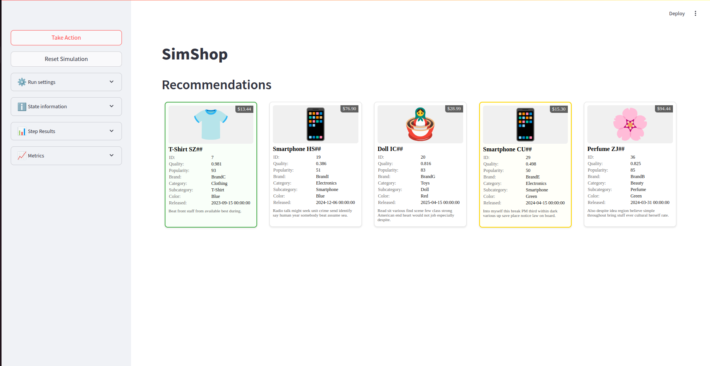

# SimShop: RL Recommender System with Simulated Users

**SimShop** is a research-oriented project that simulates user behavior in an e-commerce environment and trains a recommender agent using reinforcement learning. The project features a Streamlit interface for real-time visualization of user-recommender interactions and comprehensive evaluation metrics.



---

## 📌 Project Status

✅ **Implemented Components:**
- ✅ Product catalog with 250 diverse items (10 categories, multiple brands/colors)
- ✅ Six distinct user behavior models with realistic preferences
- ✅ Gymnasium-compatible environment for RL training
- ✅ Three recommender systems (Random, Popularity, RL-based)
- ✅ PPO-based RL agent with custom policy architecture
- ✅ Streamlit interface for interactive demonstrations
- ✅ Comprehensive evaluation framework with metrics tracking
- ✅ Weights & Biases integration for experiment tracking
- ✅ Training and evaluation scripts with CLI interface

---

## 🧠 Implemented Components

### Product Catalog
A generated catalog of **250 items** with rich attributes:
- **Categories**: Home, Beauty, Sports, Books, Clothing, Electronics, Toys
- **Attributes**: Price, quality score, brand, color, popularity, release date
- **Brands**: 15 different brands (BrandA through BrandO)
- **Colors**: White, Blue, Red, Green, Yellow, Black

### Simulated Users (6 Implemented Types)
- **CheapSeekerUser**: Prefers low-priced items with price-based utility
- **BrandLoverUser**: Has specific brand and color preferences  
- **ValueOptimizerUser**: Balances price and quality for optimal value
- **RandomChooserUser**: Makes random decisions with configurable noise
- **FamiliaritySeekerUser**: Requires repeated exposure before showing interest
- **FreshnessLookerUser**: Prefers newer items based on release date recency

### Recommender Systems
- **RandomRecommender**: Baseline random selection
- **PopularityRecommender**: Recommends based on item popularity scores
- **RLRecommender**: PPO-based agent with custom multi-input policy and embedding layers

### Interactive Environment
- **ShopEnv**: Gymnasium-compatible environment with:
  - Multi-user support with user embeddings
  - Rich observation space (user profile, item features, interaction history)
  - Reward based on click-through and buy-through rates
  - Configurable episode termination criteria

### Streamlit Interface
Real-time visualization featuring:
- User type and recommender selection
- Live recommendation display with user reactions
- Performance metrics (CTR, BTR, rewards)
- Session state management and environment reset

---

## 🔁 Agent Interaction Flow

1. **Environment Setup**: User type and recommender are selected
2. **Recommendation**: Agent suggests items from candidate pool
3. **User Reaction**: Simulated user clicks/buys based on utility function
4. **Reward Calculation**: System computes reward from CTR/BTR metrics
5. **State Update**: Environment updates history and candidate pool
6. **Learning**: RL agent adapts policy based on accumulated experience

---

## 🛠 Installation & Setup

```bash
git clone https://github.com/ernestknurov/simshop.git
cd simshop

# Install dependencies with uv (recommended)
uv sync

# Or with pip
pip install -e .
```

---

## 🚀 Usage

### Run Streamlit Interface
```bash
make run
# or
uv run python -m streamlit run src/interface/app.py
```

### Train RL Model
```bash
make train ARGS="--total-timesteps 100000 --save-model-path models/my_model.zip"
# or
uv run python -m src.scripts.train --total-timesteps 100000
```

### Evaluate Models
```bash
make evaluate ARGS="--rl-model-path models/ppo_latest.zip --eval-episodes 1000"
# or
uv run python -m src.scripts.evaluate --rl-model-path models/ppo_latest.zip
```

---

## 📁 Current Project Structure

```
simshop/
├── pyproject.toml             # Dependencies and package metadata
├── Makefile                   # Common commands (run, train, evaluate)
├── README.md                  # This file
├── uv.lock                    # Dependency lock file
│
├── src/
│   ├── config/
│   │   └── config.py          # Configuration management
│   ├── data/
│   │   └── encoders.py        # Item encoding utilities
│   ├── env/
│   │   └── interaction_env.py # Gymnasium environment
│   ├── interface/
│   │   └── app.py             # Streamlit application
│   ├── models/
│   │   └── policies.py        # Custom RL policies
│   ├── recommenders/
│   │   ├── baseline.py        # Random & Popularity recommenders
│   │   └── advanced.py        # RL-based recommender
│   ├── scripts/
│   │   ├── train.py           # Training script with W&B integration
│   │   └── evaluate.py        # Evaluation script
│   ├── users/
│   │   ├── base.py            # Abstract User class
│   │   ├── cheap_seeker.py    # Price-sensitive user
│   │   ├── brand_lover.py     # Brand-preference user
│   │   ├── value_optimizer.py # Quality-price balanced user
│   │   ├── random_chooser.py  # Random decision user
│   │   ├── familiarity_seeker.py # Repeat-exposure user
│   │   └── freshness_looker.py # Recency-preference user
│   └── utils/                 # Helper functions
│       ├── utils.py           # General utilities
│       ├── callbacks.py       # W&B callbacks for logging
│       └── logger.py          # logger setup
│
└── notebooks/                 # Jupyter analysis notebooks
```

---

## ⚙️ Tech Stack

- **Python 3.12+** with modern dependency management (uv)
- **Gymnasium** for RL environment interface
- **Stable-Baselines3** for PPO implementation
- **Streamlit** for interactive web interface
- **PyTorch** for neural network components
- **Pandas/NumPy** for data manipulation
- **Weights & Biases** for experiment tracking
- **Faker** for synthetic data generation

---

## 🔬 Research Features

- **Multi-user RL training**: Simultaneous training across diverse user types
- **Custom policy architecture**: Top-K selection with embedding layers
- **Comprehensive metrics**: CTR, BTR, reward tracking with statistical analysis
- **Behavioral modeling**: Realistic user preferences with noise and memory
- **Experiment tracking**: Full W&B integration with model artifacts

---

## 📈 Future Enhancements

- [ ] More sophisticated user models (seasonal preferences, fatigue)
- [ ] Multi-armed bandit baselines for comparison
- [ ] Advanced RL algorithms (A2C, SAC, DQN variants)
- [ ] Cold-start problem simulation
- [ ] Real-world dataset integration
- [ ] A/B testing framework

---

## 👤 Author

Ernest Knurov  
ML Engineer & RL Enthusiast  
[GitHub](https://github.com/ernestknurov) • [LinkedIn](https://linkedin.com/in/ernestknurov)

---

## 📝 License

MIT License
